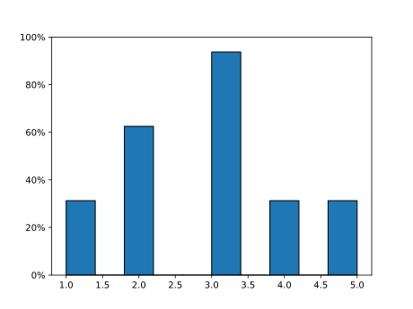

Getting Started
===============

This short guide shows the minimal steps to try ``statwrap`` in a Jupyter
notebook.

Install
-------

First install ``statwrap`` with ``pip``::

    !pip install statwrap

Load a convention
-----------------

The package offers a few sets of functions that follow different
tutorials.  For beginners we recommend the ``fpp`` functions.  Load them
with the following IPython magic command::

    import statwrap
    %use_fpp

Simple example
--------------

Once the ``fpp`` helpers are loaded you can work with a plain Python
list.  The example below shows how to draw a histogram and compute the
population standard deviation.

.. code-block:: python

    data = [1, 2, 2, 3, 3, 3, 4, 5]
    from statwrap.fpp import histogram, sd
    histogram(data, save_as="simple_hist.svg")
    sd(data)

Running this code produces the following histogram and returns ``1.17``
as the standard deviation::

    1.17

These basic steps demonstrate how ``statwrap`` can help with the
exercises from *Statistics* by Freedman, Pisani and Purves.
