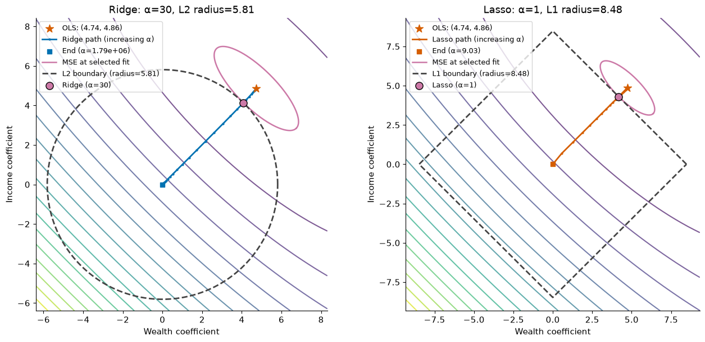

Teaching regularization
=========================

``statwrap.visualization.LossSurface`` assembles the plots used in a
regularization lecture: loss contours, coefficient paths, norm boundaries,
and principal directions. Every plot returns a Matplotlib axes object, so it
can be customized or used in a subplot. There are no required widgets.

Quick start
-------------

Use exactly two predictors. Standardize explicitly when comparing penalties
across predictors measured in different units. A DataFrame supplies readable
axis labels automatically.

.. code-block:: python

   import numpy as np
   import pandas as pd
   import matplotlib.pyplot as plt
   from sklearn.linear_model import LinearRegression
   from sklearn.preprocessing import StandardScaler
   from statwrap.visualization import LossSurface

   rng = np.random.default_rng(777)
   wealth = rng.normal(size=100)
   income = 0.8 * wealth + np.sqrt(1 - 0.8**2) * rng.normal(size=100)
   X = pd.DataFrame({"Wealth": wealth, "Income": income})
   y = 5 * wealth + 5 * income + rng.normal(size=100)
   X = pd.DataFrame(StandardScaler().fit_transform(X), columns=X.columns)
   surface = LossSurface(LinearRegression(), X, y)

   fig, axes = plt.subplots(1, 2, figsize=(13, 6), layout="constrained")
   surface.plot_regularization("ridge", alpha=30, ax=axes[0])
   surface.plot_regularization("lasso", alpha=1, ax=axes[1])

The selected solution is marked, and its norm determines the matching
boundary radius. Ridge uses a circle with radius ``np.linalg.norm(coef)``;
Lasso uses a diamond with radius ``np.abs(coef).sum()``. The new plot's bounds
include the entire boundary. Explicit coefficient ranges or axis limits take
precedence. If all coefficients are zero, the boundary becomes a point.

   The dashed boundary passes through the selected coefficient vector.
   The pink line is the exact loss contour through the selected fit.
   The path shows how fitted coefficients move as alpha increases.

Use alongside scikit-learn
---------------------------

Keep fitting, cross-validation, and test-set prediction in scikit-learn.
Statwrap supplies the teaching plots and accepts an already-fitted estimator.
For example, given training and test data with two predictors:

.. code-block:: python

   from sklearn.linear_model import Ridge
   from sklearn.pipeline import make_pipeline

   fit = make_pipeline(StandardScaler(), Ridge(alpha=30))
   fit.fit(X_train, y_train)
   predictions = fit.predict(X_test)

   ridge = fit.named_steps["ridge"]
   X_scaled = fit.named_steps["standardscaler"].transform(X_train)
   surface = LossSurface(ridge, X_scaled, y_train)
   surface.plot()

The pipeline learns scaling on the training set and reuses it for predictions.
Pass the fitted regression step and the matching transformed training data to
``LossSurface``; it does not apply pipeline transformations itself. The plotted
coefficients in this example are in standardized-predictor units.

``surface.model`` is the supplied base estimator. Calling
``surface.plot_regularization("ridge", alpha=...)`` draws a solution for that
alpha and returns axes; it does not replace ``surface.model``. Fit and retain a
scikit-learn estimator when you want predictions from a particular model.

Compose layers during a lecture
---------------------------------

.. code-block:: python

   ax = surface.plot(coefficient_range=15, label_contours=False)
   surface.plot_constraint(9, penalty="l1", ax=ax)
   surface.plot_lasso_path_on_surface(ax=ax)
   surface.plot_eigenvectors(ax=ax, length=3)
   ax.set_title("Correlated predictors: contours and shrinkage")

Reusing axes from the same ``LossSurface`` adds layers without duplicating
contours or resetting existing limits. ``draw_surface=False`` on a path method
adds only the path to arbitrary axes; ``draw_surface=True`` explicitly redraws
the background. Plot appearance options are applied when the background is
drawn. Call ``plot`` again on fresh axes to change those options.

For a direct replacement of the notebook's original drawing functions:

.. code-block:: python

   from statwrap.visualization import plot_l1_ball, plot_l2_ball

   plot_l1_ball(9, ax, color="black")
   # plot_l2_ball(3, ax, color="blue")

A manually chosen boundary is a geometric illustration; it need not touch the
solution for a chosen alpha. Use ``plot_regularization`` when that relationship
is the lesson. Its ``show_path=False`` option gives a simpler static diagram.

Coefficient paths and inspectable results
-------------------------------------------

.. code-block:: python

   surface.plot_lasso_coef_path()
   path = surface.regularization_path("ridge", alphas=[0.1, 1, 10, 100])
   print(path.alphas)        # [0, 0.1, 1, 10, 100]
   print(path.coefficients)  # one pair per alpha
   print(path.intercepts)
   print(path.mse)           # unpenalized training MSE

Default alpha grids adapt to the data. Ridge reaches strong shrinkage; Lasso's
upper end reaches the all-zero solution. User-provided alphas must be positive,
finite, and nonempty; they are sorted and duplicates removed. OLS is prepended
at zero unless ``include_ols=False``. The coefficient plot has a linear segment
near zero and a logarithmic scale above the first positive alpha, so the OLS
point appears at its actual alpha.

With exact collinearity, OLS is not unique. The minimum-norm OLS representative
may differ from the limiting Lasso solution. The Lasso plot therefore keeps
the OLS marker separate from the positive-alpha path for rank-deficient X.
It does not imply a unique feature selection when predictors are identical.

Noise and contour geometry
----------------------------

.. code-block:: python

   levels = [0.1, 0.5, 1, 2, 4, 8]
   fig, axes = plt.subplots(1, 2, figsize=(12, 5), layout="constrained")
   for response, ax in zip([y_low_noise, y_high_noise], axes):
       s = LossSurface(LinearRegression(), X, response)
       s.plot_ridge_path_on_surface(
           ax=ax, relative_loss=True, levels=levels,
           xlim=(-1, 3), ylim=(-1, 4),
       )
       ax.set_title(f"Minimum MSE: {s.minimum_loss_:.2f}")

``relative_loss=True`` plots excess MSE above the unregularized minimum. Use
identical explicit levels and limits to compare surfaces. Adding a residual
vector orthogonal to the full design (including the intercept) leaves the
least-squares coefficients, loss curvature, and regularization solutions
unchanged, apart from numerical tolerance; it shifts the absolute MSE surface
vertically. Arbitrary added noise generally also changes the coefficients.

``plot_eigenvectors`` draws eigenvectors of the relevant Gram matrix divided
by the sample count. Arrows originate at OLS, even if the base estimator is
regularized. Their labels are Gram eigenvalues; the MSE Hessian has twice those
eigenvalues. A zero eigenvalue identifies a flat direction. Data are centered
for this calculation when an intercept is fitted.

Conventions that matter in class
----------------------------------

* The background is always **unregularized mean squared error**, not the
  penalized objective and not RSS. The penalty is represented by a boundary
  or a fitted path.
* With ``fit_intercept=True``, each coefficient pair gets its optimal
  intercept. With ``fit_intercept=False``, the intercept is fixed at zero.
  Earlier versions always centered the surface; this version makes the
  no-intercept surface agree with its fitted paths.
* ``surface_loss(w)`` evaluates the plotted surface. The older
  ``evaluate_loss(w)`` retains the base model's fixed intercept unless an
  explicit intercept is supplied.
* A fitted base estimator is preserved. An unfitted estimator is cloned.
  Neither the estimator nor the caller's arrays are changed.
* ``coefficient_range`` is an axis half-width. The older ``loss_range`` keyword
  remains accepted with a ``DeprecationWarning``; it never controlled loss or
  regularization strength.
* ``alpha`` uses scikit-learn's existing convention. Ridge minimizes
  ``RSS + alpha * sum(w**2)``. Lasso minimizes
  ``MSE / 2 + alpha * sum(abs(w))``. On the plotted MSE scale, the equivalent
  penalty weights are ``alpha / n`` and ``2 * alpha``, respectively. Equal
  numerical alphas do not mean equal regularization across the two methods.

See the official `Ridge documentation
<https://scikit-learn.org/stable/modules/generated/sklearn.linear_model.Ridge.html>`_
and `Lasso documentation
<https://scikit-learn.org/stable/modules/generated/sklearn.linear_model.Lasso.html>`_
for these objective conventions. Cross-validation remains standard
scikit-learn: the example notebook uses a scaler inside the cross-validation
pipeline and ``scoring="neg_mean_squared_error"``.

The runnable lecture example is ``examples/regularization_teaching.ipynb`` in
the repository. It covers perfect collinearity, orthogonal predictors,
correlated predictors, coefficient paths, cross-validation, principal
directions, and added orthogonal noise.

API reference
---------------

.. automodule:: statwrap.visualization
   :members: LossSurface, RegularizationPath, plot_l1_ball, plot_l2_ball
